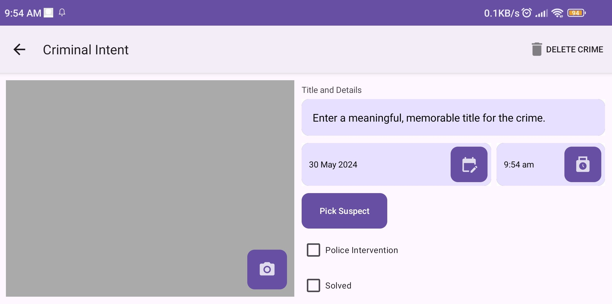
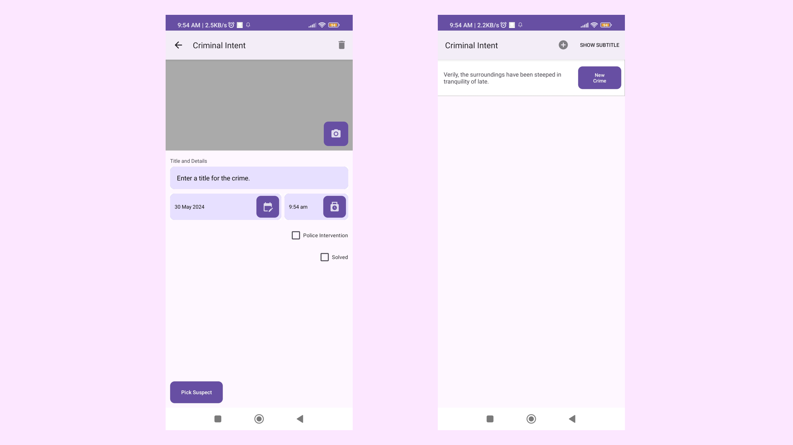

# Criminal Intent 3rd Edition – Completed with Challenges

## 📘 Project Overview

This project was developed as part of our **3rd Year Software Engineering coursework**, and it serves as our **introduction to mobile application development** using Android and Java. It closely follows the *Criminal Intent* example from the Big Nerd Ranch Guide (3rd Edition), with completed challenges and additional design improvements.

---

## ⚠️ Note on Code Differences

Since the 3rd Edition of the book is dated, many APIs and classes used in the book have since been deprecated. This project includes:

* **Updated implementations** using current Android SDK standards.
* **Modern UI components**, including the latest Material Design elements.
* **Bug fixes and usability improvements** not present in the book.

These changes may differ from the book’s exact instructions, but they reflect current best practices and ensure compatibility with Android Studio’s latest versions.

---

## 🧪 Features

* 📝 Create, edit, and delete "Crime" entries with a title, date, and resolution status.
* 📸 Add photos using the device camera (if implemented in your setup).
* 📞 Contact selection to assign suspects (requires permission handling).
* 🔄 UI updates that reflect orientation changes and lifecycle events.
* ✅ Completed **all challenge problems** from Chapters 7–19.
* 🎨 Custom UI enhancements for a better user experience.

---

## 🛠️ Technologies Used

* **Java** – Primary programming language.
* **Android SDK (API 33+)**
* **AndroidX Libraries**
* **ConstraintLayout & LinearLayout**
* **Material Components**
* **Fragments, ViewModels, and RecyclerView**
* **Jetpack Components** like LiveData and Lifecycle observers

---

## 🚀 How to Run

1. **Clone the Repository**

   ```bash
   git clone https://github.com/your-username/criminal-intent-3rd-edition.git
   ```

2. **Open in Android Studio**

   * Open Android Studio.
   * Select **"Open an Existing Project"** and navigate to the cloned folder.

3. **Build & Run**

   * Ensure an emulator or real device is connected.
   * Click **Run ▶️** or use `Shift + F10`.

4. **Permissions**

   * Allow camera and contacts access when prompted, especially if testing features involving suspects or photos.

---

## 🎓 Learning Outcomes

By completing this project, we gained hands-on experience with:

* Android app architecture (MVVM)
* Fragment lifecycle and management
* RecyclerView and adapter patterns
* ViewModel and LiveData for state handling
* Permissions handling (runtime)
* Debugging and refactoring outdated code

---

## 🖼️ Screenshots

| Landscape Menu                     | Portrait Mode + New Crime        |
| ---------------------------------- | -------------------------------- |
|  |  |

---

## 📈 Future Improvements

* Add full chapter-by-chapter documentation of code additions.
* Migrate to **Kotlin** for modern Android development.
* Add **Room Database** instead of manual file-based persistence.
* Implement **Unit Testing** for core logic and data handling.
* Improve **accessibility** and **tablet support**.

---

## 🙌 Contribution

Want to improve this project? Contributions are welcome!

### Steps to Contribute:

1. Fork the repository.
2. Create your feature branch:

   ```bash
   git checkout -b feature/amazing-feature
   ```
3. Commit your changes:

   ```bash
   git commit -m "Add amazing feature"
   ```
4. Push to your branch:

   ```bash
   git push origin feature/amazing-feature
   ```
5. Open a pull request and describe your changes.

---

## 📄 License

This project is licensed under the **GNU General Public License v3.0** – see the [LICENSE](LICENSE) file for details.

> The GPL-3.0 license permits the free use, modification, and distribution of this software under specific conditions. Any derivative work must also be released under the same license.

---

## 👥 Credits

* **Developer**: Sam Adrian P. Sabalo
* **Course**: Computer Science, 3rd Year
* **Instructor**: Sir Brylle Nosostros, MIT
* **Reference**: *Android Programming: The Big Nerd Ranch Guide, 3rd Edition*
