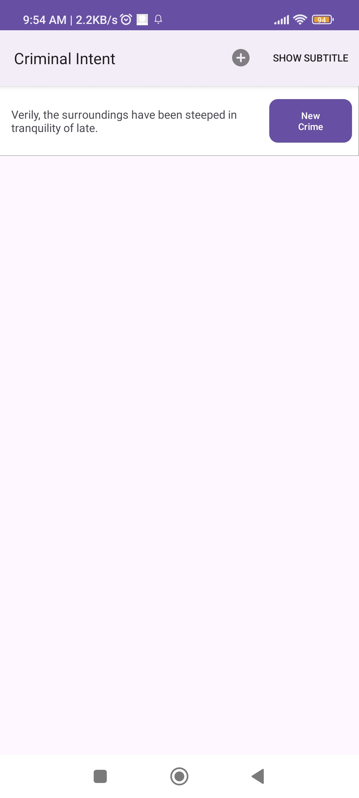
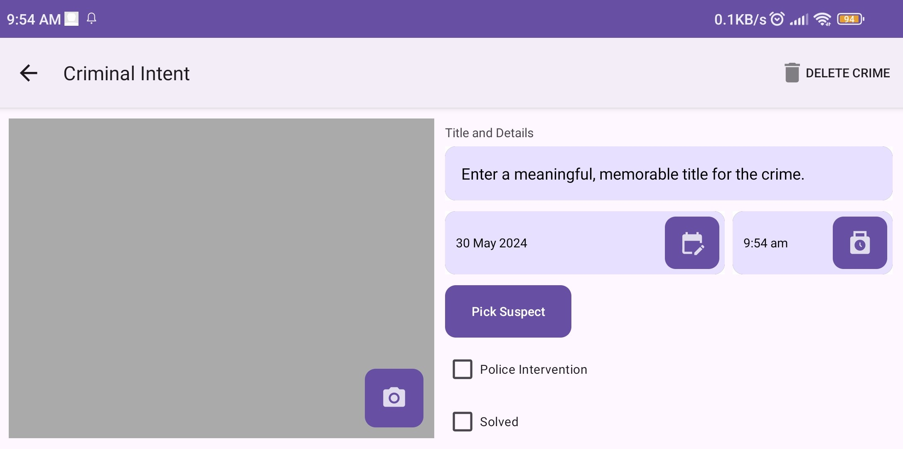

# Criminal Intent 3rd Edition with Challenges Completed

Completion of Chapter 7 - Chapter 19 of Criminal Intent from Big Nerd Ranch Guide 3rd Edition along with its challenges with a little bit of my own design.

## Note

Since the 3rd Edition of the book was quite old, some of the code written in the book might not match with what was implemented in the code. You'll know this as some of the code you write from the book will be marked as "deprecated". You might also see some changes that are not in the book. These are changes that I added. You may check it and decide if you deem that it is a great change to add to your app. Happy Coding.

## Images

## Future Improvements

I will soon be adding a chapter by chapter segment of the book each highlighting the code that had been added to the app. This will help you navigate which code was with what chapter.

## License

This project is licensed under the GNU General Public License v3.0 - see the [LICENSE](LICENSE) file for details.

The GPL-3.0 license grants users the freedom to use, modify, and distribute this software under certain conditions. It also requires that any modifications made to the software are also licensed under the GPL-3.0.

